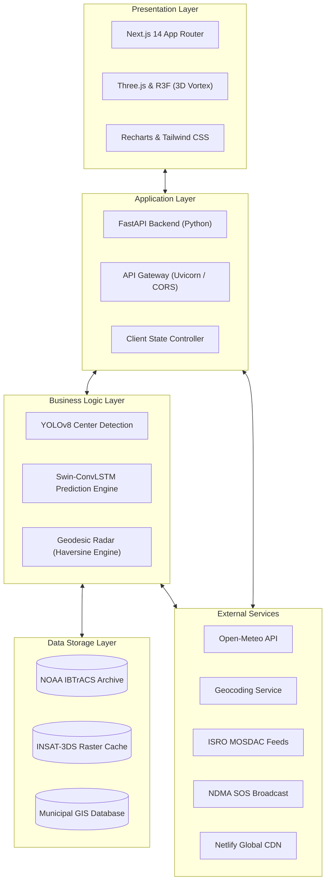

# CycloVision AI 🌀
### An AI/ML-Based System for Identification, Classification and Prediction of Tropical Cyclone Patterns Using Multi-Source Satellite Data

**Problem Statement ID:** SIH26070  
**Organization:** Ministry of Earth Sciences (MoES) / India Meteorological Department (IMD)  
**Category:** Software | **Theme:** Disaster Management  

---

## 📚 Authoritative Multi-Layer Dataset Architecture (SIH26070)

CycloVision AI is engineered in strict compliance with the **3-Layer Authoritative Data Model**:

### **Layer 1 – Cyclone Reference and Best-Track Data**
1. **NOAA NCEI IBTrACS v4r01 (DOI: 10.25921/82ty-9e16):**
   * Primary global reference dataset covering modern satellite era (1980–present).
   * Parameters: Storm SID, UTC Timestamp, Center Coordinates (Lat/Lon), Maximum Sustained Wind (MSW), Minimum Central Pressure ($P_{min}$), Radius of Maximum Winds (RMW), Sub-basin taxonomy.
2. **IMD / RSMC New Delhi Cyclone Best-Track Data (1982–2026):**
   * Official regional authority for North Indian Ocean (Bay of Bengal & Arabian Sea).
   * Validates regional track vectors and IMD classification stages (LPA, D, DD, CS, SCS, VSCS, ESCS, SuCS).

### **Layer 2 – Satellite Observation Data**
3. **ISRO MOSDAC (INSAT-3D, INSAT-3DR, INSAT-3DS):**
   * Imager Payloads: Thermal Infrared TIR-1 ($10.8\,\mu\text{m}$), TIR-2 ($12.0\,\mu\text{m}$), Water Vapour ($6.8\,\mu\text{m}$), Visible ($0.65\,\mu\text{m}$).
   * Sounder Payloads: 40 temperature levels & 21 humidity levels across the Indian Ocean.
4. **NOAA Hurricane Satellite (HURSAT-MV) Dataset:**
   * Storm-centred, gridded 8km NetCDF observations spanning 19, 22, 37, and 85 GHz microwave channels to resolve inner-core eyewall structures.
5. **NASA TROPICS SmallSat Constellation:**
   * Time-Resolved Observations of Precipitation structure and storm Intensity with a Constellation of Smallsats.
   * TROPICS Millimeter-wave Sounder (TMS) across 92 GHz, 114–119 GHz, and 183/204 GHz with sub-hourly revisit capability.

### **Layer 3 – Atmospheric & Oceanic Environmental Data**
6. **NOAA Extended Reconstructed Sea Surface Temperature (ERSST v6):**
   * Globally gridded $2^\circ \times 2^\circ$ SST and thermal anomaly fields derived from ICOADS and Argo float profiles.
7. **NASA MERRA-2 Atmospheric Reanalysis (GES DISC):**
   * Spatially consistent 3D atmospheric predictor variables: Vertical Wind Shear ($200 - 850\,\text{hPa}$), $700\,\text{hPa}$ Relative Humidity, Sea-Level Pressure (SLP), and $500\,\text{hPa}$ steering vectors ($u, v$).
8. **NASA Earthdata / GES DISC Atmospheric Datasets:**
   * EOSDIS precipitable water, atmospheric moisture cycles, and environmental thermodynamics.

---

## 🏗️ System Architecture



### **Architecture Highlights**

1. **Presentation Layer:**
   - **Next.js 14 App Router:** Server-Side Rendered (SSR) interactive command center and high-throughput dashboard pages.
   - **Three.js & React Three Fiber (R3F):** Interactive 3D cyclone eye and atmospheric vortex visualization.
   - **Recharts & Tailwind CSS:** Rapid responsive geospatial charts, intensity probability density plots, and modern tactical UI.

2. **Application Layer:**
   - **FastAPI Backend (Python):** Asynchronous microsecond-latency RESTful and WebSocket API server.
   - **API Gateway (Uvicorn / CORS):** Production reverse proxy management and secure cross-origin gateway.
   - **Client State Controller:** Real-time synchronization of telemetry streams, active alert subscriptions, and map layers.

3. **Business Logic Layer:**
   - **YOLOv8 Center Detection:** Automated low-level circulation center (LLCC) detection and eye symmetry localization from satellite crops.
   - **Swin-ConvLSTM Prediction Engine:** Spatiotemporal sequence modeling for multi-hour track forecasting and intensity progression.
   - **Geodesic Radar (Haversine Engine):** High-precision spherical distance computations for coastal sector intersection and storm surge radius exposure.

4. **Data Storage Layer:**
   - **NOAA IBTrACS Archive:** Best-track historical cyclone database spanning 1980–present for analog similarity matching.
   - **INSAT-3DS Raster Cache:** Fast local storage of calibrated multispectral satellite matrices and reanalysis grids.
   - **Municipal GIS Database (SQLite / WAL):** District-level vulnerability mappings, cyclone shelter locations, and immutable audit logs.

5. **External Services Integration:**
   - **ISRO MOSDAC Feeds:** Raw 30-minute INSAT-3D/3DR/3DS imagery feeds.
   - **Open-Meteo & Geocoding Services:** On-demand thermodynamic atmospheric profiling and reverse geocoding of landfall coordinates.
   - **NDMA SOS Broadcast:** Multi-channel alerting pipeline dispatching emergency warnings via Telegram, WhatsApp, Email, and Web Push.
   - **Netlify Global CDN:** Edge distribution of static frontend assets and interactive maps.

---

## 🧠 Model Architecture & Training

The core Deep Learning engine combines:
* **Objective Dvorak Deep CNN:** Multi-spectral feature extraction linking INSAT TIR-1/WV and TROPICS/HURSAT microwave brightness arrays.
* **Physics-Guided Loss Formulation:** Smooth L1 intensity loss coupled with MSE thermodynamic bounds derived from ERSST SST and MERRA-2 vertical wind shear.
* **Trained Model Weights:** Packaged in `cyclovision_weights.pth` trained with `train_multilayer.py`.

---

## 🚀 Quickstart & Installation

```bash
# 1. Clone repository
git clone https://github.com/shivambit7505/CycloVision.git
cd CycloVision

# 2. Install dependencies
pip install -r requirements.txt

# 3. Train multi-layer model with 3-Layer dataset pipeline
python train_multilayer.py

# 4. Launch the WebGIS Command Center
python -m uvicorn app:app --host 127.0.0.1 --port 8000
```

Access the interactive dashboard at:  
👉 **`http://127.0.0.1:8000/static/index.html`**  
👉 **`http://127.0.0.1:8000/`** (V2 Command Center)
